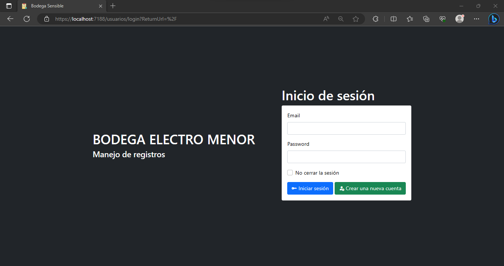
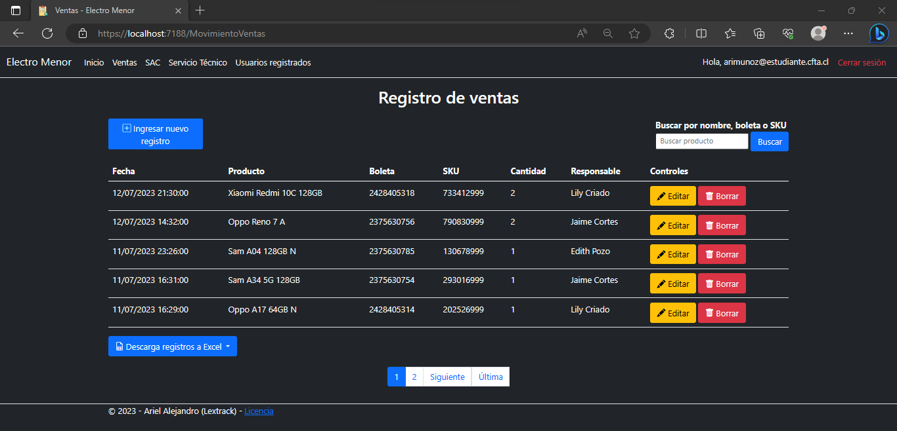
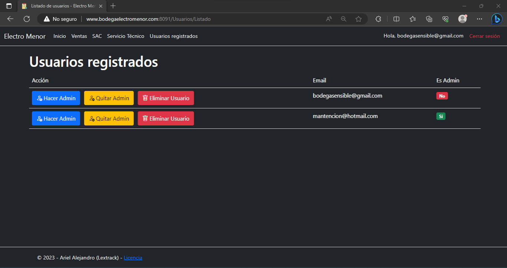

<h1 align="center">Gestor Movimientos Bodega Electro Menor</h1>

<h2 align="center">Proyecto similar</h2>

Si quieres algo similar y más "genérico" (sin tanta regla de negocio), puedes revisar este otro repositorio: <a href="https://github.com/lextrack/Gestor De Inventario Web">Gestor de Inventario Web</a>

